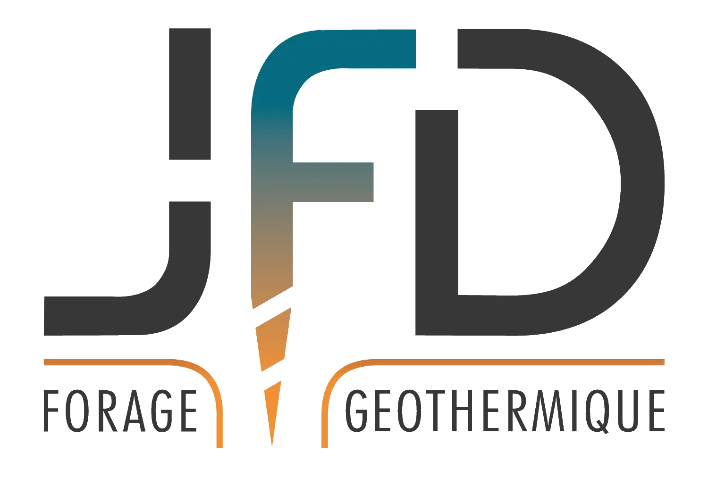

<div align="center">
  
</div>

# JFD forage

Site vitrine (Next.js, export statique) de **JFD forage**, entreprise spécialisée
dans le forage géothermique vertical en Belgique et au Luxembourg.

## Développement local

```bash
npm install
npm run dev        # http://localhost:3000
```

Autres commandes :

```bash
npm run lint       # ESLint (next lint)
npm run build      # build + export statique dans ./out (régénère aussi la galerie)
```

> La liste des photos de la galerie (`src/gallerie_files.json`) est régénérée
> automatiquement avant chaque build via le script `prebuild`. Ajoutez simplement
> vos images dans `public/img/gallerie/`.

## Déploiement

Le déploiement est **entièrement automatisé** via GitHub Actions
(`.github/workflows/deploy.yml`) : chaque `push` sur `master` construit le site
et le publie sur GitHub Pages (domaine `jfdforage.be`).

```bash
git push origin master   # déclenche build + déploiement
```

Le dossier `out/` n'est plus versionné : il est généré par la CI.
